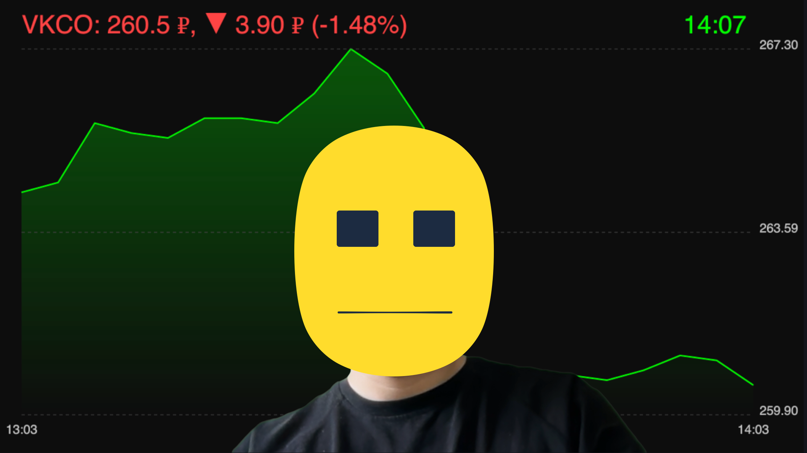
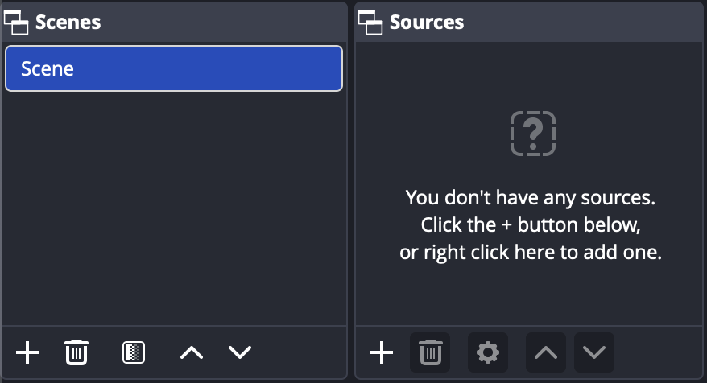
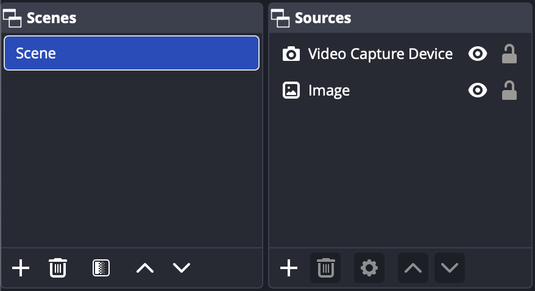
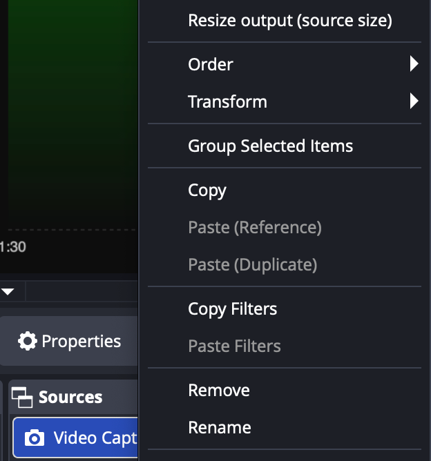
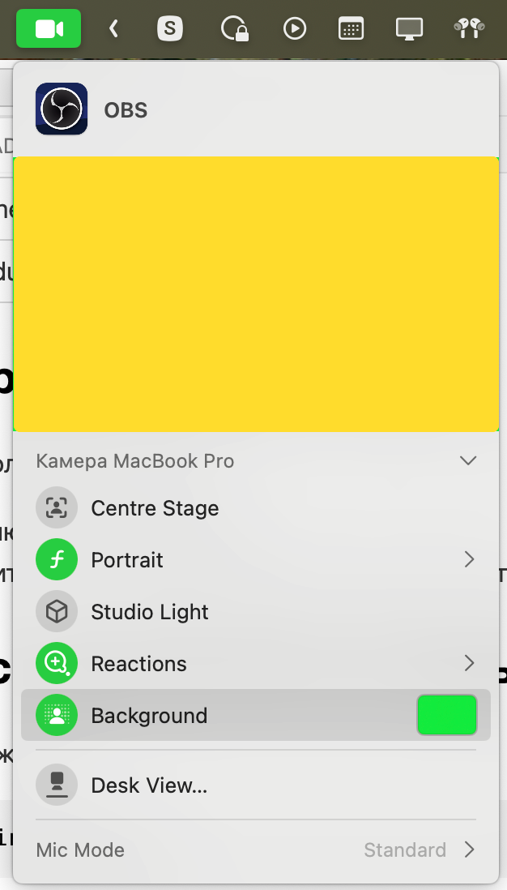
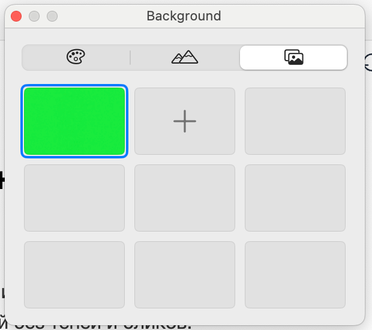
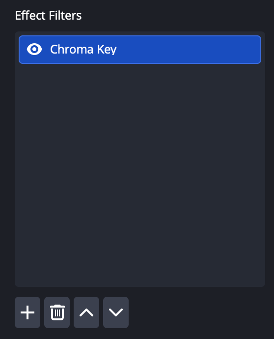
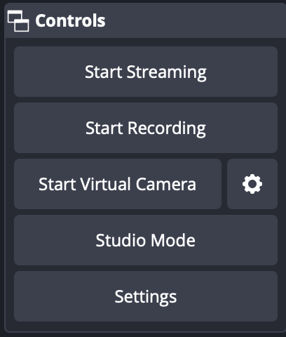
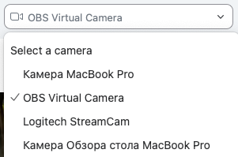
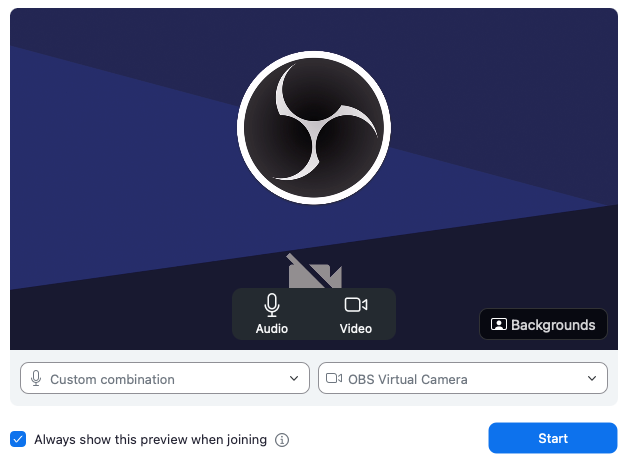

# 📈 Stock Background

Этот проект создаёт **обновляемое изображение с графиком акций**, которое можно использовать как фон во время созвонов. Фон обновляется каждую минуту и берёт данные из **Тинькофф Инвестиций**.



## Терминология

| Переменная     | Описание                          | Пример                         |
| -------------- | --------------------------------- | ------------------------------ |
| `TICKER`       | Код акции (тикер на бирже)        | `SBER`, `VKCO`, `GAZP`, `YNDX` |
| `CLASS_CODE`   | Код рынка (для акций на Мосбирже) | `TQBR`                         |
| `HISTORY_TIME` | Интервал данных для графика       | `-1h` (1 час), `-1d` (1 день)  |

## Установка проекта

```bash
git clone https://github.com/yangirov/stock-background.git
cd stock-background
npm install
```

## Настройка окружения

Скопируйте пример конфигурации:

```
cp .env.example .env
```

Заполните необходимые поля:

```
HISTORY_TIME=-1h
TICKER=VKCO
CLASS_CODE=TQBR
TOKEN=your_tinkoff_token
```

## Получение токена Тинькофф Инвестиций

- Перейдите на [страницу токенов](https://tinkoff.github.io/investAPI/token/) Тинькофф Инвестиций
- Создайте токен для песочницы (чтобы нельзя было торговать)
- Скопируйте и вставьте токен в .env файл

## Запуск проекта

Сначала нужно установить зависимости:

```bash
npm i
```

Запуск в продакшн режиме:

```bash
npm start
```

Запуск в режиме разработки (используется nodemon):

```bash
npm run dev
```

После запуска скрипт создаёт файл `./background.png` в корне проекта и обновляет его каждую минуту.

## Настройка OBS Studio

1. Установите OBS Studio: [https://obsproject.com/](https://obsproject.com/)
2. Разрешите доступ к камере (к микрофону необязательно).
3. При первом запуске дайте разрешение на установку Virtual Camera.

_Virtual Camera_ — виртуальная веб-камера, которую OBS транслирует в другие приложения (Zoom, Telegram, Google Meet и т.д.).

### Настройка сцены в OBS

1. Создайте новую сцену.



2. В разделе **Sources** добавьте два источника:
   - **Image** → выберите путь к `background.png`
   - **Video Capture Device** → выберите свою камеру

Проверьте порядок источников. Таким образом, камера будет поверх фона.

```
Sources:
  - Webcam (сверху)
  - Image Stocks (снизу)
```



P.S. Если картинки не подходят под размер экрана, можно принудительно их подогнать под размер экрана.



## Настройка зелёного фона

Если используется macOS, в меню камеры.



Нажмите на Background и загрузите картинку из `./assets/green-screen.jpg`.



Убедитесь, что фон равномерно зелёный без теней и бликов.

### Применение фильтра Chroma Key

Этот фильтр нужно настроить на камере в OBS чтобы он вырезал зеленый фон и была видна картинка с акциями.

1. Выделите источник `Video Capture Device` правой кнопкой мыши.
2. Нажмите **Filters**.
3. В разделе **Effect Filters** добавьте **Chroma Key**.
4. Можно оставить настройки по умолчанию или поиграться для лучшего эффекта:

| Параметр        | Значение |
| --------------- | -------- |
| Key Colour Type | Green    |
| Similarity      | 400      |
| Smoothness      | 80       |
| Spill Reduction | 100      |



### Запуск виртуальной камеры

В OBS нажмите `Start Virtual Camera`.



В выбранном приложении (Zoom, Telegram, Meet и т.п.) установите камеру `OBS Virtual Camera`.



Если вместо камеры OBS видна заглушка, значит либо камера не запущена, либо не даны нужные разрешения в системе.



### Проверка

- OBS показывает сцену с фоном и камерой.
- Файл `background.png` обновляется каждую минуту.
- Видеофон в приложениях обновляется вместе с графиком.

## Возможные проблемы

| Проблема                  | Решение                                         |
| ------------------------- | ----------------------------------------------- |
| OBS не обновляет картинку | Отключите галку «Unload image when not showing» |
| Zoom не видит OBS         | Убедитесь, что Virtual Camera включена          |
| Хромакей вырезает не всё  | Подстройте параметр `Similarity`                |
| Ошибка API                | Проверьте токен и подключение к интернету       |
